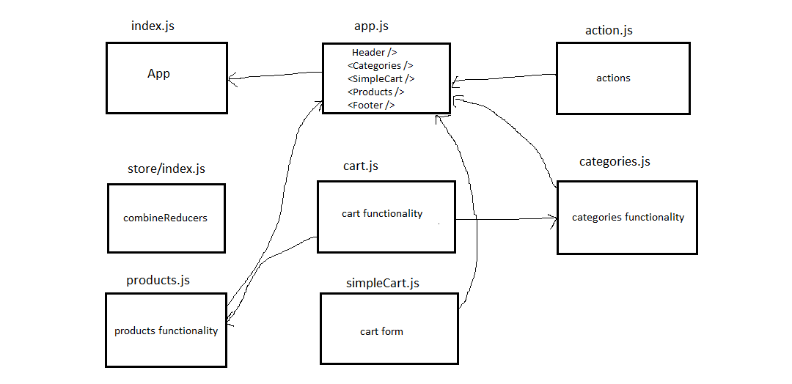

# storefront

## Project: storefront

### Author: Anas Zain

### Links and Resources

- [submission PR](https://github.com/401-advanced-javascript-anas/storefront/pull/2)
- [Heroku]()

### Setup

#### How to initialize/run your application 

- `npm run start`

#### How to use your library 
#### Tests
- Code test: `npm run test`

#### UML

